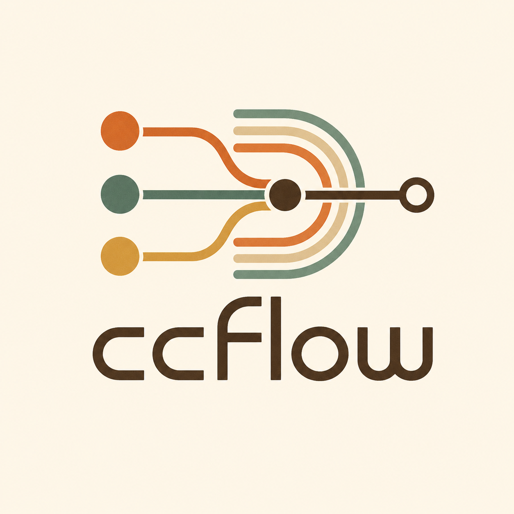
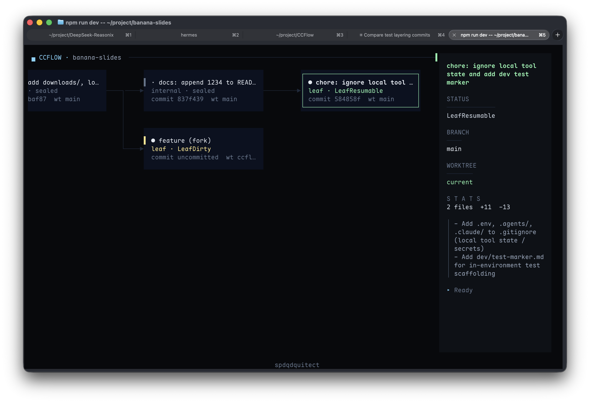
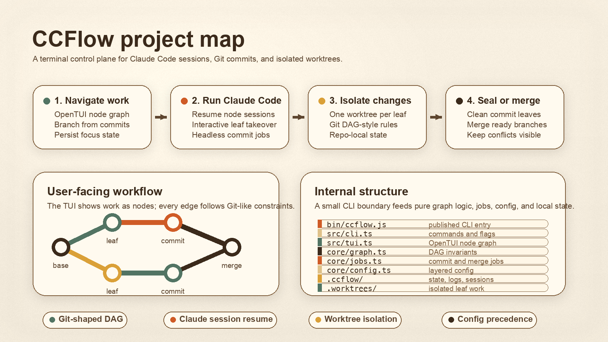

# CCFlow

[English](./README.md)

<p align="center">
  
</p>

## Why CCFlow？

你是否有以下问题？

打开 Claude Code，开始 coding，完成一个 feature 后，执行 `/commit`，或者自己手动 commit。然后 `/clear`，继续 coding。这个流程已经极度简化了，但有没有更好的方式？

数个 feature 完成，甚至数个项目 coding 完成后，你发现这个项目里之前某个 feature 写得有点问题，想看看当时的 Claude Code 会话，但那个会话已经被淹没在一堆历史会话里了。

什么是 worktree？我该怎么同时写两个 feature？

如果你有以上问题，欢迎使用 CCFlow 来优化你的 Claude Code 工作流程。



## CCFlow 是什么？

CCFlow 是一个 **节点式 Claude Code 会话管理器**。在 CCFlow 中，节点即会话，节点即 commit。

具体来说，在一个不涉及 worktree 开发，也就是不需要同时开发多个特性的场景下，你只需要启动 `ccflow`，在根节点中使用 `Enter` 进入 Claude Code，然后像平时使用 Claude Code 一样进行编码。编码完成后，使用两次 `Ctrl+C` 退出 Claude Code，即可回到节点管理页面。你只需要在这个节点上敲击 `Tab` 就可以新建一个节点。此时后台正在发生的是：CCFlow 正在调用你的 Claude Code CLI 进行自动化 commit，保存你上一轮的工作成果；与此同时，你可以正常进入新建的节点，获得一个干净的上下文并继续你的工作。自动 commit 完成后，你可以通过节点视图查看这个节点的 commit 信息，commit 信息会总结你在这个节点中的工作。

在涉及 worktree 开发的场景下，你可以简单地通过在一个节点上敲击 `Shift+Tab` 新建一个同级节点。你可以在同级节点中同时进行工作，并在节点管理视图里使用空格键多选节点后按 `m` 进行合并。此时后台正在发生的是：CCFlow 调用你的 Claude Code CLI 对选中的多个节点进行 commit，并在所有节点 commit 完成后继续调用 Claude Code 进行自动化 merge。merge 完成后，CCFlow 会给你一个新的节点和干净的上下文，你可以继续你的工作。



## 环境要求

- Node.js 22 或更新版本
- Git
- `PATH` 中可用的 Bun，用于 OpenTUI 运行时
- Claude Code CLI 可通过 `claude` 调用，或通过 CCFlow 配置指定

包安装阶段会检查 OpenTUI 运行时。如果 Bun 不可用，并且当前 Node.js 也无法通过 `node:ffi` 加载 `@opentui/core`，安装会直接失败。

## 安装

CCFlow 0.1.0 目前建议通过本仓库生成的 npm tarball 安装。

1. 先安装 Bun。

   macOS 和 Linux：

   ```bash
   curl -fsSL https://bun.com/install | bash
   bun --version
   ```

   也可以使用 Homebrew 或其他包管理器安装 Bun，只要 `bun` 命令最终在 `PATH` 中可用即可。

2. 克隆仓库并安装开发依赖。

   ```bash
   git clone https://github.com/lxy/ccflow.git
   cd ccflow
   npm install
   ```

3. 生成 npm tarball。

   ```bash
   npm pack
   ```

   `npm pack` 会执行 package 的 `prepack` 脚本，构建 `dist/`，并在仓库根目录生成 `ccflow-0.1.0.tgz`。

4. 全局安装生成的 tarball。

   ```bash
   npm install -g ./ccflow-0.1.0.tgz
   ccflow --version
   ccflow doctor
   ```

   修改源码后，如果希望全局安装的 CLI 也使用新代码，需要重新运行 `npm pack` 并再次安装生成的 tarball。

## 首次运行

在已有 Git 仓库中运行：

```bash
ccflow
```

首次启动时，CCFlow 会解析所属的 Git 仓库，在该仓库中初始化 `.ccflow/` 运行时状态目录，并打开 TUI。`.ccflow/`、`.worktrees/` 和 `.claude/` 都是内部运行时路径，应该保持未追踪。

如果你希望显式初始化：

```bash
ccflow init
ccflow
```

如果当前目录不是 Git 仓库，`ccflow` 不会静默执行 `git init`。要显式创建一个新 Git 仓库并初始化 CCFlow：

```bash
mkdir my-work
cd my-work
ccflow init --git
ccflow
```

首次运行时常用检查：

```bash
ccflow doctor
ccflow config path
ccflow config show-effective
```

`ccflow doctor` 会检查 Node.js、Git、OpenTUI 运行时、仓库状态、配置有效性、prompt 配置，以及 Claude Code CLI 是否可用。

## 命令

```bash
ccflow [--repo <path>] [--no-auto-init] [--claude-bin <path>] [--model <name>]
ccflow init [path] [--git] [--force]
ccflow doctor [--repo <path>]
ccflow config path [--repo <path>]
ccflow config show-effective [--repo <path>]
ccflow config set --global <field> <value>
ccflow config prompt <commit|merge> [--repo <path>]
ccflow --help
ccflow --version
```

`--repo` 允许你从任意目录运行 CCFlow，但把目标指向指定仓库。从子目录或 CCFlow 管理的 worktree 中运行时，会解析回 owner repository 的状态，而不是创建一个独立项目。

`--no-auto-init` 会禁用本次调用的自动初始化。`--claude-bin` 和 `--model` 会覆盖本次调用的 Claude Code 设置。

## 配置

运行时状态存放在 `.ccflow/`。共享项目配置写在 `<repo>/.ccflowrc`；本机项目覆盖写在 `<repo>/.ccflow/config.local.json`；用户默认配置写在 `~/.ccflowrc` 或 `$XDG_CONFIG_HOME/ccflow/config.json`。

配置文件是 JSON 对象。环境变量和 CLI 参数会先转换为相同的配置结构，再合并到最终生效配置中。

配置优先级从低到高如下：

1. 内置默认值
2. 旧版 `<repo>/.ccflow/prompts.json`，如果存在
3. 共享项目配置：`<repo>/.ccflowrc`
4. 用户全局配置：`~/.ccflowrc` 或 `$XDG_CONFIG_HOME/ccflow/config.json`
5. 仓库本机配置：`<repo>/.ccflow/config.local.json`
6. 环境变量
7. CLI 参数

如果设置了 `CCFLOW_CONFIG`，它会成为用户全局配置路径。否则，只有当 `$XDG_CONFIG_HOME/ccflow/config.json` 存在且 `~/.ccflowrc` 不存在时，CCFlow 才会使用 XDG 路径；其他情况使用 `~/.ccflowrc`。

嵌套对象会按字段合并。数组会整体替换低优先级数组。把字段设置为 `null` 会把该字段重置为内置默认值。

共享项目配置可以设置安全的工作流默认值，但本地可执行文件路径、受限 Claude Code 参数和禁用 job 的设置必须来自用户全局配置、仓库本机配置、环境变量或 CLI 参数。也就是说，`<repo>/.ccflowrc` 不能设置：

- `claude.bin`
- `claude.headlessArgs`
- `claude.interactiveArgs`
- `claude.disableJobs`

查看配置路径和带来源标注的生效配置：

```bash
ccflow config path
ccflow config show-effective
```

通过 CLI 写入用户全局配置：

```bash
ccflow config set --global claude.model sonnet
ccflow config set --global prompts.commit.instructions '["Keep commits small.","Run npm test before committing."]'
```

## 配置字段

```json
{
  "claude": {
    "bin": "claude",
    "headlessArgs": [],
    "interactiveArgs": ["--dangerously-skip-permissions"],
    "model": "haiku",
    "disableJobs": false,
    "terminalQuarantineMs": 800
  },
  "startup": {
    "autoInit": true
  },
  "worktree": {
    "enterLeafAutoSwitch": true,
    "warnBeforeSwitch": false,
    "directory": ".worktrees",
    "branchPrefix": "ccflow/"
  },
  "merge": {
    "sealMergedInputs": true,
    "headlessResolution": true
  },
  "prompts": {
    "commit": {
      "instructions": [],
      "messageStyle": "concise conventional commits when appropriate",
      "testPreferences": []
    },
    "merge": {
      "instructions": [],
      "testPreferences": []
    }
  },
  "tests": {
    "commands": []
  }
}
```

字段含义：

- `claude.bin`：交互式和后台 Claude Code 调用使用的可执行文件。
- `claude.headlessArgs`：后台 commit 和 merge job 中放在 `-p` 之前的额外参数。
- `claude.interactiveArgs`：进入或恢复交互式 Claude Code 会话时使用的参数。
- `claude.model`：传给后台 Claude Code job 的模型名。
- `claude.disableJobs`：为 `true` 时禁用后台 Claude Code job。
- `claude.terminalQuarantineMs`：从交互式 Claude Code 返回后，CCFlow 重新绘制 TUI 前等待的时间。
- `startup.autoInit`：允许 `ccflow` 在已有 Git 仓库中自动初始化 `.ccflow/`。
- `worktree.enterLeafAutoSwitch`：进入叶子节点时自动切换 shell/worktree 上下文。
- `worktree.warnBeforeSwitch`：启用后，在切换 worktree 前要求确认。
- `worktree.directory`：CCFlow 管理 worktree 使用的目录。
- `worktree.branchPrefix`：CCFlow 生成分支时使用的前缀。
- `merge.sealMergedInputs`：merge 成功后封存参与 merge 的输入叶子节点。
- `merge.headlessResolution`：允许 Claude Code 在后台 job 中尝试解决 merge conflict。
- `prompts.commit.instructions`：追加到受保护 commit kernel prompt 后面的 commit job 指令。
- `prompts.commit.messageStyle`：commit message 风格指令。
- `prompts.commit.testPreferences`：追加到 prompt 中的 commit job 测试偏好。
- `prompts.merge.instructions`：追加到受保护 merge kernel prompt 后面的 merge job 指令。
- `prompts.merge.testPreferences`：追加到 prompt 中的 merge job 测试偏好。
- `tests.commands`：会写入 commit 和 merge job prompt 的项目检查命令。

环境变量映射：

| 环境变量 | 配置字段 |
| --- | --- |
| `CCFLOW_CONFIG` | 用户全局配置文件路径 |
| `CCFLOW_CLAUDE_BIN` | `claude.bin` |
| `CCFLOW_CLAUDE_ARGS` | `claude.headlessArgs` |
| `CCFLOW_CLAUDE_MODEL` | `claude.model` |
| `CCFLOW_DISABLE_CLAUDE_JOBS` | `claude.disableJobs`，`1` 表示 `true` |
| `CCFLOW_TERMINAL_QUARANTINE_MS` | `claude.terminalQuarantineMs` |
| `CCFLOW_BRANCH_PREFIX` | `worktree.branchPrefix` |
| `CCFLOW_WORKTREE_DIR` | `worktree.directory` |
| `CCFLOW_AUTO_INIT` | `startup.autoInit`，`0` 表示 `false` |

CLI 覆盖映射：

| CLI 参数 | 配置字段 |
| --- | --- |
| `--no-auto-init` | `startup.autoInit=false` |
| `--claude-bin <path>` | `claude.bin` |
| `--model <name>` | `claude.model` |

## Prompt 自定义

CCFlow 会保留不可覆盖的 commit 和 merge job kernel instructions。这些指令用于保护工作流契约：commit job 必须让 worktree 变干净，或在没有可提交内容时保持干净；merge job 必须在可行时解决冲突并创建 merge commit，或者保留冲突供交互式接管。

用户和项目可以通过追加字段提供指导，例如 commit instructions、merge instructions、commit message style 和 test preferences。默认会拒绝完整替换 prompt。

不启动 Claude Code，只查看最终 prompt：

```bash
ccflow config prompt commit
ccflow config prompt merge
```

## 发布验证

普通代码更新只需要正常 Git push。GitHub Actions 会运行类型检查和 package 内容校验，但不会发布到 npm：

```bash
git push
```

要发布正式 npm 版本，选择版本号升级类型并推送生成的 tag：

```bash
npm run release:patch
```

如果不是 patch 版本，可以使用 `npm run release:minor` 或 `npm run release:major`。推送的 `vX.Y.Z` tag 会触发 npm 发布 workflow，且 workflow 会拒绝 tag 与 `package.json` 版本不一致，或版本号不高于 npm 已发布最高版本的发布。

手动发布前，仍然可以运行完整的本地验证：

```bash
npm run verify:release
```

该命令会构建运行时产物、运行测试、检查 package 内容、在隔离的 global prefix 中安装生成的 tarball，并验证安装后的 `ccflow` 命令。
